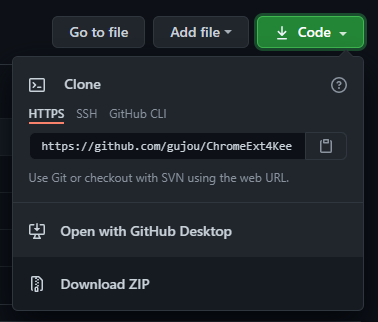
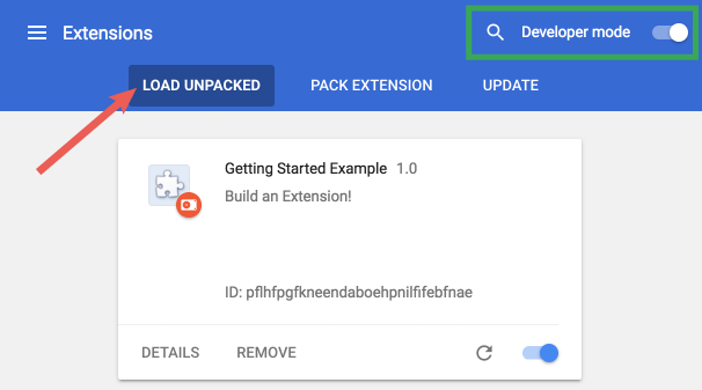
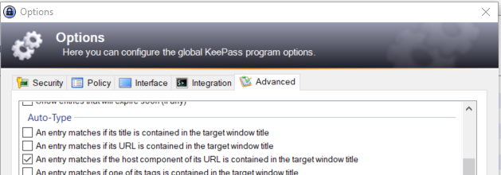

# ChromeExt4KeePass

## Very SIMPLE Chrome Extension to

* Display in browser tab title the domain name *(and tls usage when active)*
* Simplify KeePass Auto-Type recognition *(remember to fill KeePass URL field)*
* Quickly see the domain name *(limit phishing)* 

## [Install Chrome Extension in Developer Mode](https://www.google.com "Stolen in Chrome Developers Getting started documentation") (Working on Brave)

1. Open [My GitHub Page](https://github.com/gujou/ChromeExt4KeePass "Yeah!")
1. Click on "Download ZIP" under "Code"  

1. Extract where YOU want
1. Open the Extension Management page by navigating to **chrome://extensions**  
*The Extension Management page can also be opened by clicking on the Chrome menu, hovering over More Tools then selecting Extensions*
1. Enable Developer Mode by clicking the toggle switch next to "Developer mode"
1. Click the "LOAD UNPACKED" button and select the "Extension" directory *(previously downloaded and unzipped)*

1. "Ta-da!" *(Google ©)*

## Upgrade KeePass Options

1. Go to *Options... > Advanced > Auto-Type* menu

1. Select *Any entry matches if the host component of its URL is contained in the target window title*
1. Unselect *Any entry matches if its title is contained in the target window title* if you want reduce false positive *(with this way of doing, you must to fill URL fields)*
1. Edit the entries you want to use and fill their URL fields
