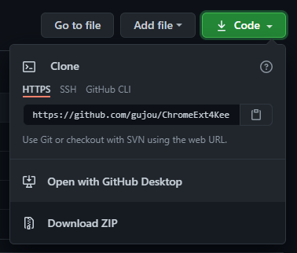
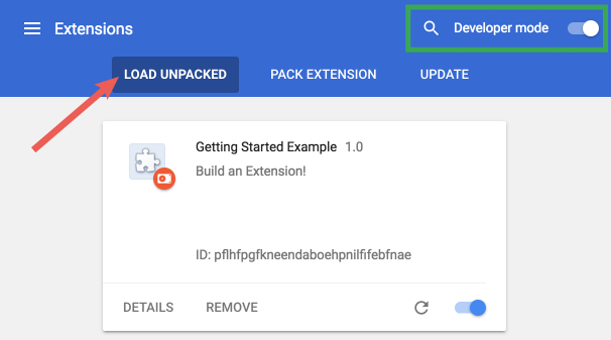

# ChromeExt4KeePass

## [Intall Chrome Extension](https://www.google.com "Extract from Chrome Developers Getting started documentation") (Working on Brave)

1. Open [My GitHub Page](https://github.com/gujou/ChromeExt4KeePass "Yeah!")
1. Click on "Download ZIP" under "Code"  

1. Extract where YOU want
1. Open the Extension Management page by navigating to chrome://extensions  
*The Extension Management page can also be opened by clicking on the Chrome menu, hovering over More Tools then selecting Extensions*
1. Enable Developer Mode by clicking the toggle switch next to "Developer mode"
1. Click the "LOAD UNPACKED" button and select the "Extension" directory in extracted ZIP

1. "Ta-da!" *(Google ©)*
